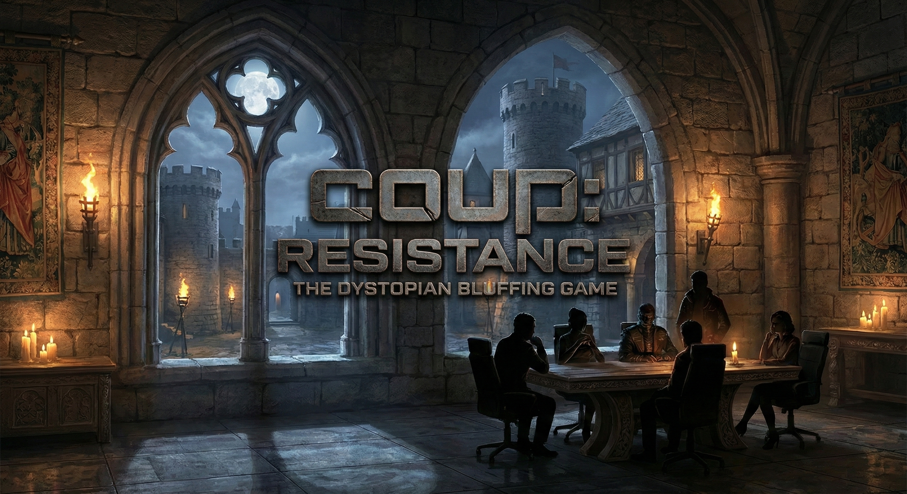

# 쿠 온라인 (Coup Online) 🃏

> **거짓말과 심리전의 보드게임** — 친구들과 실시간으로 플레이하세요!

<p align="center">
  
</p>

Next.js 14 + Firebase Realtime Database + Tailwind CSS로 만든 **실시간 멀티플레이어 쿠(Coup) 보드게임**입니다. 2~6인이 각자의 디바이스에서 접속하여 블러핑, 도전, 쿠데타를 즐길 수 있습니다.

---

## ✨ 주요 기능

### 🎮 게임 플레이
- **2~6인 실시간 멀티플레이** — Firebase Realtime Database 기반 동기화
- **완전한 쿠 규칙 구현** — 소득, 외국 원조, 세금징수, 암살, 갈취, 교환, 쿠데타
- **도전 & 블록 시스템** — 모든 플레이어가 도전/블록/패스 선택 가능
- **추측 모드 (Guess Mode)** — 쿠데타 시 상대 캐릭터를 추측하는 확장 규칙
- **30초 응답 타이머** — 시간 초과 시 자동 패스 처리
- **랜덤 선공** — 매 게임 시작 시 무작위로 첫 번째 플레이어 결정
- **추방 재접속 차단** — 방장에게 추방된 플레이어는 같은 방 재입장 불가

### 🖥️ UI/UX
- **모바일 최적화** — Galaxy S21(360px) 등 소형 화면 완벽 대응
- **다크 모드 전용 디자인** — 골드 & 다크 테마의 프리미엄 UI
- **캐릭터 카드 일러스트** — 각 캐릭터별 고유 이미지 및 컬러
- **카드 정보 모달** — 카드 탭하여 캐릭터 능력 확인 (내 카드 + 상대 공개 카드)
- **게임 규칙 모달** — 게임 중 규칙 확인 가능 (📖 버튼)
- **실시간 응답 타이머 바** — 색상 변화(초록→주황→빨강) 카운트다운
- **스크롤 가능한 모달** — 모든 모달이 모바일에서 스크롤 지원
- **토스트 알림** — 게임 이벤트 실시간 토스트 메시지
- **구조화된 게임 로그** — 턴 구분선 + 아이콘 + 컬러 코딩 (게임 로그 + 채팅 병합)
- **암살 도전 위험 경고** — 암살 도전 시 2명 피해 경고 배너
- **에러/404 페이지** — 없는 방, 잘못된 URL, 런타임 에러 대응

### 💬 소셜 기능
- **퀵챗 로그** — 미리 정의된 빠른 채팅 메시지, 게임 로그에 병합 표시
- **낙관적 UI** — 내 채팅 즉시 표시, 상대 메시지는 Firebase 구독
- **온라인 상태 표시** — 플레이어 접속 상태 실시간 확인
- **프레즌스 시스템** — Firebase Presence 기반

### 🔊 사운드 & 음악
- **배경음악 (BGM)** — 자동 루프, 재생/정지/음소거 컨트롤
- **게임 효과음** — 액션별 사운드 피드백 + 모바일 햅틱

### ⚙️ 기타
- **방 생성 & 코드 공유** — 4자리 코드로 방 입장
- **게임 재시작** — 방장이 언제든 재시작 가능 (비방장은 대기 안내)
- **OG 메타데이터** — 카카오톡, 슬랙 등 링크 공유 시 미리보기
- **SEO 최적화** — 한글 메타데이터, Open Graph, Twitter Card

---

## 🏗️ 기술 스택

| 영역 | 기술 |
|------|------|
| **프레임워크** | Next.js 14 (App Router) |
| **언어** | TypeScript |
| **스타일링** | Tailwind CSS 3 |
| **백엔드/DB** | Firebase Realtime Database |
| **실시간 동기화** | Firebase Realtime Subscriptions |
| **프레즌스** | Firebase Presence |
| **아이콘** | Lucide React |
| **폰트** | Sora, Space Mono (Google Fonts) |
| **테스트** | Jest + ts-jest |
| **배포** | Vercel |

---

## 🚀 시작하기

### 1. Firebase 프로젝트 생성

1. [Firebase Console](https://console.firebase.google.com) 접속
2. **프로젝트 추가** → 프로젝트 이름 입력
3. **Realtime Database** → **데이터베이스 만들기** → 리전 선택 (Asia Southeast 권장)
4. 보안 규칙은 테스트 모드로 시작 후 필요 시 설정

### 2. 환경 변수 설정

프로젝트 루트에 `.env.local` 파일 생성:

```env
NEXT_PUBLIC_FIREBASE_API_KEY=your-api-key
NEXT_PUBLIC_FIREBASE_AUTH_DOMAIN=your-project.firebaseapp.com
NEXT_PUBLIC_FIREBASE_PROJECT_ID=your-project-id
NEXT_PUBLIC_FIREBASE_STORAGE_BUCKET=your-project.firebasestorage.app
NEXT_PUBLIC_FIREBASE_MESSAGING_SENDER_ID=your-sender-id
NEXT_PUBLIC_FIREBASE_APP_ID=your-app-id
NEXT_PUBLIC_FIREBASE_DATABASE_URL=https://your-project-default-rtdb.firebasedatabase.app
```

> Firebase Console → **프로젝트 설정 → 일반 → 내 앱** 에서 값 확인

### 3. 의존성 설치 & 실행

```bash
npm install
npm run dev
```

→ `http://localhost:3000` 접속

### 4. 테스트

```bash
npm test
```

---

## 🎲 게임 방법

1. 로비에서 **닉네임** 입력
2. **방 만들기** → 4자리 방 코드 생성
3. 친구에게 방 코드 공유 (각자의 기기에서 접속)
4. 방장이 **게임 시작** 버튼 클릭
5. 블러핑, 도전, 쿠데타로 최후의 1인이 되세요! 🎉

---

## 🃏 캐릭터 & 액션 가이드

### 기본 액션 (누구나 가능)

| 액션 | 효과 | 차단 가능 |
|------|------|-----------|
| 💰 **소득** | 코인 +1 | ❌ |
| 🤝 **외국 원조** | 코인 +2 | 공작이 차단 가능 |
| ⚡ **쿠데타** | 코인 7개 소모, 상대 카드 강제 제거 | ❌ |

### 캐릭터 고유 액션

| 캐릭터 | 고유 능력 | 방어 능력 |
|--------|-----------|-----------|
| 👑 **공작** (Duke) | 세금징수 — 코인 +3 | 외국 원조 차단 |
| 🌹 **백작부인** (Contessa) | — | 암살 차단 |
| ⚔️ **사령관** (Captain) | 갈취 — 상대 코인 2개 빼앗기 | 갈취 차단 |
| 🗡️ **암살자** (Assassin) | 암살 — 코인 3개로 상대 카드 제거 | — |
| 🕊️ **대사** (Ambassador) | 카드 교환 — 덱에서 2장 보고 교체 | 갈취 차단 |

### 핵심 규칙

- **도전**: 다른 플레이어의 캐릭터 주장이 거짓이라고 생각하면 도전! 성공 시 상대 카드 제거, 실패 시 자신의 카드 제거
- **블록**: 특정 액션을 방어할 수 있는 캐릭터를 가지고 있다고 주장하여 차단
- **코인 10개 이상**: 반드시 쿠데타를 해야 함
- **카드 2장 모두 제거**: 게임에서 탈락

---

## 📁 프로젝트 구조

```
coup/
├── app/                          # Next.js App Router
│   ├── layout.tsx                # 루트 레이아웃 + 메타데이터
│   ├── page.tsx                  # 로비 페이지
│   ├── not-found.tsx             # 404 페이지
│   ├── error.tsx                 # 에러 바운더리
│   ├── game/[roomId]/page.tsx    # 게임 페이지
│   └── api/game/                 # 게임 API 라우트
│       ├── create/               # 방 생성
│       ├── join/                 # 방 참가 (추방 차단 포함)
│       ├── kick/                 # 플레이어 추방
│       ├── start/                # 게임 시작
│       ├── action/               # 게임 액션
│       ├── ready/                # 준비 상태
│       ├── restart/              # 게임 재시작
│       ├── timeout/              # 타임아웃 처리
│       └── check/                # 방 상태 확인
├── components/game/              # 게임 UI 컴포넌트
│   ├── GameBoard.tsx             # 메인 게임 보드
│   ├── ActionPanel.tsx           # 액션 선택 패널
│   ├── PlayerArea.tsx            # 상대 플레이어 영역
│   ├── MyPlayerArea.tsx          # 내 플레이어 영역
│   ├── ResponseModal.tsx         # 도전/블록/패스 응답 모달
│   ├── CardSelectModal.tsx       # 카드 선택 모달
│   ├── ExchangeModal.tsx         # 대사 교환 모달
│   ├── CardInfoModal.tsx         # 캐릭터 정보 모달
│   ├── GameRulesModal.tsx        # 게임 규칙 모달
│   ├── EventLog.tsx              # 구조화된 게임 로그
│   ├── GameToast.tsx             # 토스트 알림
│   ├── BgmPlayer.tsx             # BGM 플레이어
│   ├── QuickChat.tsx             # 퀵챗
│   ├── SettingsModal.tsx         # 설정 모달
│   └── WaitingRoom.tsx           # 대기실
├── lib/
│   ├── game/
│   │   ├── engine.ts             # 게임 엔진 (핵심 로직)
│   │   ├── engine.test.ts        # 게임 엔진 테스트
│   │   ├── filter.ts             # 플레이어별 상태 필터링
│   │   └── types.ts              # 타입 정의
│   ├── firebase.ts               # Firebase 서버 설정
│   ├── firebase.client.ts        # Firebase 클라이언트 (구독/채팅)
│   ├── audio.ts                  # 사운드 매니저
│   ├── useGameAudio.ts           # 게임 사운드 훅
│   └── storage.ts                # 로컬 저장소 유틸
├── public/
│   ├── cards/                    # 캐릭터 카드 이미지
│   ├── audio/                    # BGM 및 효과음
│   └── og/                       # OG 이미지
└── tailwind.config.ts            # Tailwind 설정
```

---

## 🌐 Vercel 배포

1. [vercel.com](https://vercel.com) → GitHub 저장소 연결
2. **Environment Variables** 에 `.env.local`의 모든 Firebase 환경 변수 추가
3. **Deploy** 클릭!

---

## 📋 릴리스 노트

전체 변경 이력은 **[CHANGELOG.md](./CHANGELOG.md)** 를 참고하세요.

| 버전 | 날짜 | 요약 |
|------|------|------|
| [v0.4.0](./CHANGELOG.md#040--2025-02-24) | 2025-02-24 | 게임 엔진 개선, 에러 페이지, 추방 차단, 채팅 통합 |
| [v0.3.0](./CHANGELOG.md#030--2025-02-23) | 2025-02-23 | BGM, 퀵챗, OG 메타데이터, 모바일 최적화 |
| [v0.2.0](./CHANGELOG.md#020--2025-02-23) | 2025-02-23 | 응답 타이머, 응답 모달 리디자인, 효과음 |
| [v0.1.0](./CHANGELOG.md#010--2025-02-23--초기-릴리스) | 2025-02-23 | 초기 릴리스 |


---

## 📄 라이선스

MIT License

---

<p align="center">
  Made with ❤️ and 🃏
</p>

